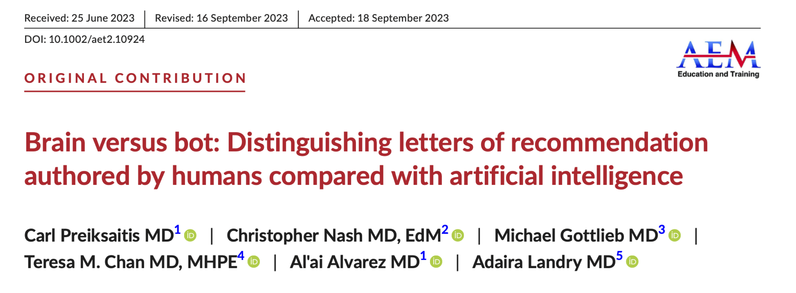

# Example: Letters of Recommendation

AI can be extremely useful to offload administrative work that takes up a lot of our time and effort. Although there is a big discussion that could be had about whether AI should or should not be used in letters of recommendation, people are certainly doing it and it can do a pretty great job at getting you started. Is using AI that much different than working off a template for letters (as many authors do). Perhaps it can help with reviewing and extracting "boilerplate" information and allow us more time to focus on personal, human evaluation of a candidate.

You can review a study we did below that compared human-authored and AI-generated letters of recommendation for promotion below.

<figure><figcaption></figcaption></figure>



**Prompt:** "Act as an expert in writing letters of recommendation for promotion and tenure. use the attached CV to write a letter of recommendation to the rank of associate professor using the attached promotion criteria. Ensure that you include a section for each of the promotion criteria."

For this example, we upload promotion criteria for a fictional institution as well as my CV.

<figure><figcaption></figcaption></figure>

<figure><figcaption></figcaption></figure>

<figure><figcaption></figcaption></figure>

As with all of our examples, this is a start. It will need to be refined and edited and made more personal, but it can get you most of the way there so you can focus on adding your own personal details to the letter.
